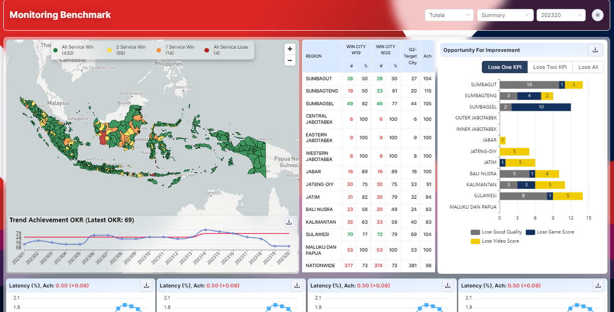
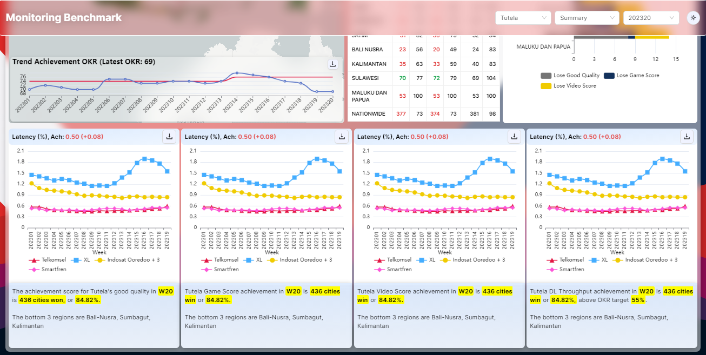
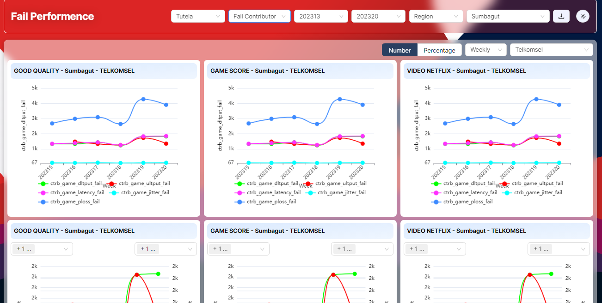
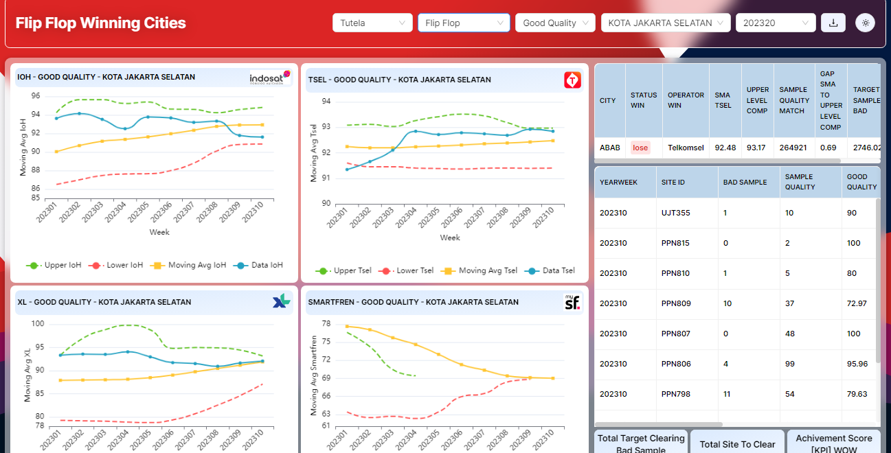
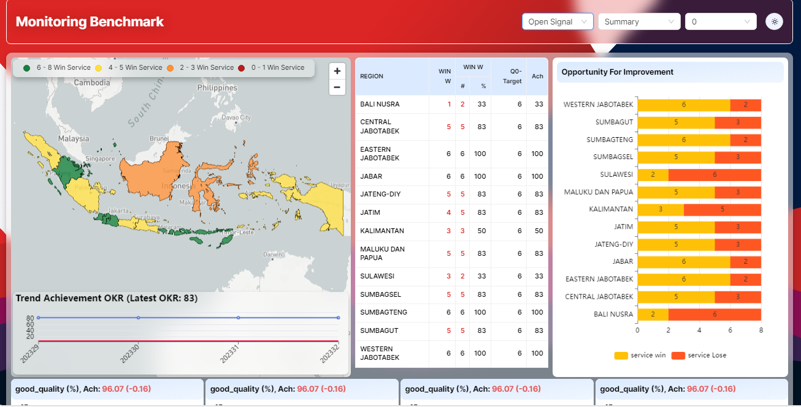

# Benchmark Monitoring

This project, named **Benchmark Monitoring** is on of Dashboard Monitoring Key Performa Indicator (KPI) data for Indoensia Telecomunication providers.
.this web application built using React, Vite.js, TypeScript, Tailwind CSS and UI Liblary (E-chart, Mapbox, etc.). 
It serves as a platform for Benchmarking Monitoring, providing insights and data visualization for various key performance indicators (KPIs).

## Getting Started

To run the project locally, follow these steps:

1. Clone the repository:

   ```bash
   git clone https://github.com/arimaulanahardan/Benchmark-Monitoring
   ```

2. Navigate to the project directory:

   ```bash
   cd Benchmark-Monitoring
   ```

3. Install dependencies:

   ```bash
   npm i
   ```

4. Run the development server:

   ```bash
   npm run dev
   ```

   This will start the development server, and you can view the application at `http://localhost:3000`.

## Scripts

- `yarn dev`: Start the development server.
- `yarn build`: Build the production-ready application, create a zip file, and move it to the root directory.
- `yarn build-windows`: Build the production-ready application for Windows.
- `yarn preview`: Preview the production build locally.
- `yarn test`: Run Jest tests.

## Dependencies

- [react](https://reactjs.org/) - JavaScript library for building user interfaces.
- [vite](https://vitejs.dev/) - Fast React development server.
- [typescript](https://www.typescriptlang.org/) - Typed superset of JavaScript.
- [tailwindcss](https://tailwindcss.com/) - A utility-first CSS framework.
- [antd](https://ant.design/) - A React UI library with a set of high-quality components.
- [axios](https://axios-http.com/) - Promise-based HTTP client.
- [echarts](https://echarts.apache.org/) - Powerful charting and visualization library.
- [mapbox-gl](https://docs.mapbox.com/mapbox-gl-js/overview/) - Interactive maps with WebGL.
- [react-redux](https://react-redux.js.org/) - Official React bindings for Redux.
- [react-router-dom](https://reactrouter.com/web/guides/quick-start) - Declarative routing for React.js.

## Project Structure

- **`app.tsx`**: The main entry point of the application, including routing and layout.
- **`common/`**: Directory containing common components and utilities.
- **`filter/`**: Directory containing components related to filtering and state management.
- **`Open-Signal/`**: Directory containing components specific to the Open Signal section.
- **`achievements_table.tsx`**, **`KPI.tsx`**, **`fail_contributor.tsx`**, and other files: Components for different sections of the application.

## Usage

The `App` component in `app.tsx` represents the structure of the entire application. Routes and components are organized to provide a comprehensive benchmarking experience.

Feel free to customize the content, styles, and components to fit specific requirements and branding.

## Screenshot
### Dashboard Monitoring Benchmark



### Dashboard Fail Performance


### Flip Flop Winning Cities


### Monitoing Summary Benchmark

